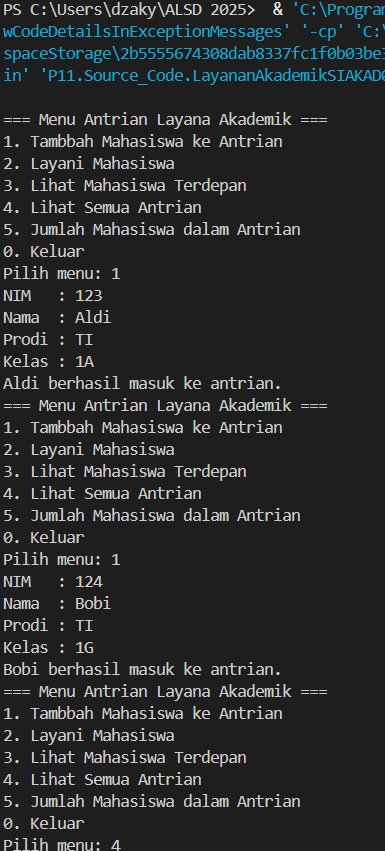

| | Algoritma dan Struktur Data|
|--|--|
| NIM | Dzaky Hadyan Eliyanta |
| Kelas | TI - 1H |

# Pertemuan 11 QUEUE

## 1. Praktikum Percobaan 1

Source code dari praktikum percobaan 1 berada di Source_Code/Queue07.java dan Source_Code/QueueMain07.java, dan berikut screenshot dari hasilnya


**Jawaban Pertanyaan**

1. Nilai awal attribute front dan rear bernilai -1 karena kedua attribute tersebut digunakan untuk menyimpan nilai index array, sehingga -1 digunakan untuk menandakan bahwa kedua attribute tersebut belum menunjuk ke index manapun, sedangkan attribute size bernilai 0 karena attribute size menyimpan nilai berapa banyak elemen yang sudah terisi di array

2. Potongan kode tersebut berfungsi untuk memindah rear ke awal array apabila rear sudah berada di akhir array

3. Potongan kode tersebut berfungsi untuk memindah front ke awal array apabila front sudah berada di akhir array

4. Proses perulangan variable i dimulai dari 0 karena nilai depan dan belakang array pada queue bisa terbalik dan bisa tidak sesuai pada depan-belakang array karena sudah diubah menggunakan dequeue, sehingga tidak bergantung pada depan-belakang fisik, tapi pada depan-belakang virtual

5. Potongan kode tersebut akan menghasilkan nilai 0 apabila nilai i/front sudah sama dengan nilai `max`, sehingga berfungsi untuk memindah nilai i/front ke index ke 0 apabila sudah mencapai akhir array

6. Potongan kode program yang mengecek apabila queue overflow adalah berikut
```
if (size == max) {
            return true;
        } else {
            return false; 
        }
```
dan berikut adalah potongan kode program yang menampilkan respons apabila queue overflow
```
if (isFull()) {
            System.out.println("Queue sudah penuh");
        }
```

7. Modifikasi yang saya lakukan adalah pada kondisi perulangan dowhile
```
        } while (!Q.isEmpty() && !Q.isFull());
```

## 2. Praktikum Percobaan 2

Source code dari praktikum percobaan 2 berada di Source_Code/Mahasiswa07.java, Source_Code/AntrianLayanan07.java, dan Source_Code/LayananAkademikSIAKAD07.java, dan berikut screenshot dari hasilnya




**Jawaban Pertanyaan**

Berikut adalah modifikasi pada AntrianLayanan07.java
```
    public void lihatAkhir() {
        if (isEmpty()) {
            System.out.println("Antrian kosong.");
        } else {
            System.out.println("Mahasiswa posisi belakang: ");
            System.out.println("NIM - NAMA - PRODI - KELAS");
            data[rear].tampilkanData();
        }
    }
```

Berikut adalah modifikasi pada LayananAkademikSIAKAD07.java
```
System.out.println("6. Cek Antrian paling belakang");
```
```
case 6:
                    antrian.lihatAkhir();
                    break;
```

