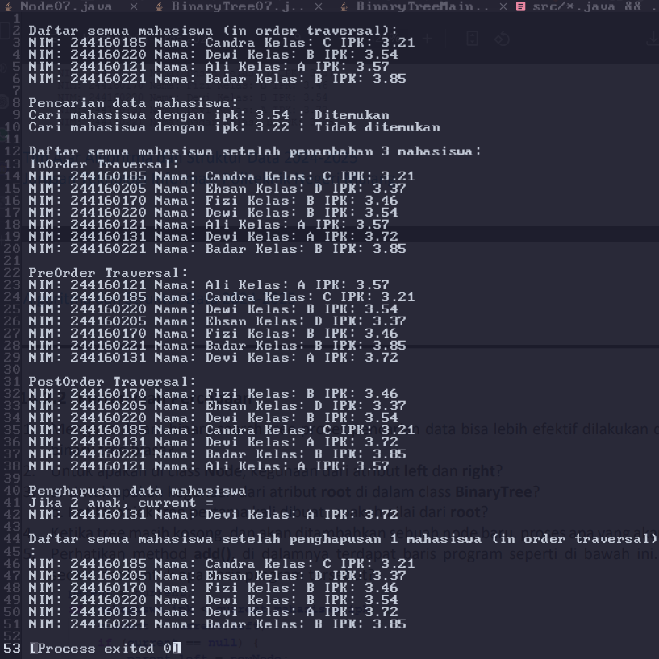
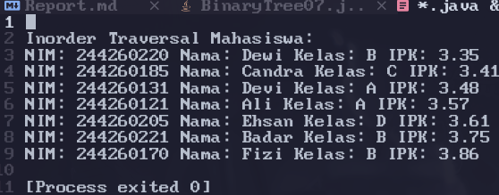

| | Algoritma dan Struktur Data|
|--|--|
| NIM | Dzaky Hadyan Eliyanta |
| Kelas | TI - 1H |

# Pertemuan 14 Tree

## 1. Kegiatan Praktikum 1

Source code dari kegiatan praktikum 1 berada di src/Mahasiswa07.java, src/Node07.java, src/BinaryTree07.java, dan src/BinaryTreeMain07.java, dan berikut screenshot dari hasilnya

**Jawaban Pertanyaan**

1. Dalam binary search tree, proses pencarian data bisa lebih efektif dilakukan karena susunan datanya yang mengharuskan semua left-child lebih kecil nilainya dibandingkan right-child dan parent-nya. Sehingga apabila dilakukan proses searching, tidak perlu menelusuri seluruh Node

2. Atribut `left` dan `right` pada Class `Node07` berfungsi sebagai pointer yang menunjuk ke node dibawahnya atau left-child dan right-child-nya

3. a. Atribut `root` berfungsi sebagai node paling awal dan satu-satunya node di tree yang kita pegang referensinya, perannya seperti head di linked list
b. Nilai dari `root` adalah null

4. Proses yang terjadi adalah method `add()` akan menginstansiasi object `Node07()` bernama `newNode` dengan parameter `mahasiswa`, kemudian meng-assign `root` dengan `newNode`

5. Baris kode program tersebut menyeleksi nilai dari `newNode`, apabila `newNode` < node diatasnya, maka `newNode` akan menjadi left-child, dan sebaliknya

6. Method `delete()` menghapus 2 anak dengan cara memanggil method `getSuccessor()` untuk menyimpan nilai dari successor atau cucu dari node yang dihapus, selanjutnya menampilkan data dari `successor`, lalu melakukan pemilihan. Apabila node yang dihapus merupakan `root`, akan meng-assign `root` dengan `successor`. Apabila node yang dihapus merupakan left-child, `getSuccessor()` akan menjadikan `successor` sebagai parent dari child dari node yang dihapus, kemudian `delete()` menjadikan `successor` sebagai child dari root. Hal yang sama terjadi jika node yang dihapus merupakan right-child, tetapi `successor` disambungkan dengan `root` sebagai right-child-nya

## 2. Kegiatan Praktikum 2

Source code dari kegiatan praktikum 2 berada di src/Mahasiswa07.java, src/Node07.java, src/BinaryTreeArray07.java, dan src/BinaryTreeArrayMain07.java, dan berikut screenshot dari hasilnya

**Jawaban Pertanyaan**

1. Atribut `data` berfungsi untuk menyimpan objek-objek `Mahasiswa07` yang digunakan untuk menyimpan struktur binary tree dalam bentuk array, sedangkan atribut `idxLast` berfungsi sebagai indeks maksimum array

2. Method `populateData()` berfungsi untuk mengisi array `dataMahasiswa` dengan `dataMhs[]` dan menentukan kapasitas maksimum binary tree

3. Method `traverseInOrder()` berfungsi untuk mengunjungi left-child, menampilkan informasinya, mengunjungi right-child, dan seterusnya, dari index ke `idxStart`

4. left-child berada di indeks 2*2+1=5, sedangkan right-child berada di indeks 2*2+2=6

5. Statement tersebut berfungsi untuk menentukan kapasitas array `dataMahasiswa`, artinya 

6. Indeks tersebut digunakan karena itu merupakan representasi binary tree dalam array 1 dimensi, dimana untuk indeks i, left-child-nya adalah 2*i+1 dan right-child-nya adalah 2*i+2

## Tugas Praktikum

Source code dari tugas praktikum berada di src/Mahasiswa07.java, src/BinaryTree07.java, src/BinaryTreeArray07.java, dan src/Tugas.java, dan berikut screenshot dari hasilnya

